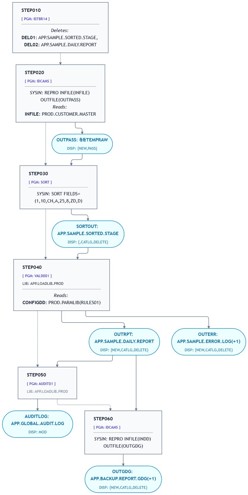

# jcl2Mermaid

`jcl2Mermaid` is a lightweight CLI tool designed to download or read JCL (Job Control Language) files and convert them into a Mermaid diagram to help visualize execution flow.

---


## ⚙️ Installation

1. **Clone the repository**:
   ```bash
   git clone https://github.com/GoudaCouda/jcl2mermaid.git
   cd jcl2mermaid
   ```

2. **Install the package:**
   ```bash
   pip install -e .
   ```

---

## 🛠️ Setup

1. **Copy the example configuration file:**
   ```bash
   cp .env.example .env
   ```

2. **Edit `.env` with your defaults** (optional):
   ```ini
   DOWNLOAD_METHOD=ftp
   DOWNLOAD_HOSTNAME=mainframe.example.com
   DOWNLOAD_USERNAME=YOUR_USER
   DOWNLOAD_PASSWORD=YOUR_PASSWORD
   ```

---

## 🚀 Running the Program

Once installed, you can execute `jcl2mermaid` directly from your command line.

### Option 1: Parse a Local JCL File

If your JCL file is stored locally on your machine:
```bash
jcl2mermaid --downloadmethod local --jclname "path/to/your/file.jcl"
```

### Option 2: Download & Parse via FTP

To download and process a JCL dataset from a mainframe via FTP:
```bash
jcl2mermaid --downloadmethod ftp --hostname mainframe.example.com --username MYUSER --jclname "HLQ.LIB.SRC(JCLNAME)"
```
*(If `DOWNLOAD_PASSWORD` is not set in `.env`, you will be prompted for your password.)*

---

## 💡 Example

Check out the [`examples/`](examples) folder for a complete sample setup.


### Run Command:
```bash
jcl2mermaid --downloadmethod local --jclname examples/sample.jcl -o examples/sample.mmd
```

### Output Diagram Preview:


---

## 📑 CLI Options

| Argument | Description | Default |
| :--- | :--- | :--- |
| `--jclname` | **(Required)** Full path or dataset name of the JCL file. | *None* |
| `--downloadmethod` | Download method (`local`, `ftp`, `ssh`, `zowe`). | `ftp` (or `.env` value) |
| `--hostname` | Hostname/IP address for remote download. | `.env` value |
| `--username` | Username for remote download. | `.env` value |
| `-o`, `--output` | Custom output path for the generated `.mmd` diagram file. | `./<jclname>.mmd` (Current Directory) |
| `-p`, `--print` | Print raw Mermaid diagram syntax directly to `stdout`. | `False` |
   